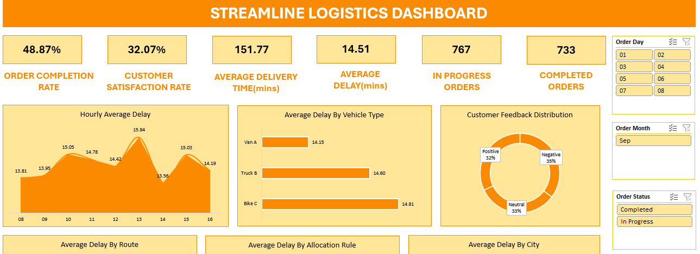

# Delivery Optimisation Analysis (Supply Chain)
## Table of Contents
- [Project Overview](#project-overview)
- [Exploratory Questions](#exploratory-questions)
- [Skills Demonstrated](#skills-demonstrated)
- [Data Sources](#data-sources)
- [Tools Used](#tools-used)
- [Data Cleaning](#data-cleaning)
- [Data Analysis](#data-analysis)
- [Findings](#findings)
- [Recommendations](#recommendations)
- [Challenges](#challenges)

### Project Overview
---
**Objective:**
Developed an interactive Excel dashboard to streamline order fulfillment processes and provide actionable insights for addressing operational inefficiencies. The project aimed to enhance delivery performance, minimize delays, and improve customer satisfaction within the logistics and supply chain domain.

**Key Features:**

- KPI Automation & Ad-hoc Reporting: Created Office Scripts to calculate and update key metrics, including: Order Completion Rate, Average Delivery Time, Delay Impact, Customer Satisfaction Score as well as creating ad-hoc reports.
- Conditional Formatting: Automated visual highlights for critical delays and performance issues to facilitate quick decision-making.
- Data Visualization: Designed dynamic charts and tables to track important data metrics.

**Performance Insights:** 
Identified key challenges such as high delays for specific routes (e.g., Route 3) and vehicles (e.g., Bike C), low customer satisfaction rates, and backlog dominance.

### Exploratory Questions
---
Here are some questions that served as a guide for insights:
1. What is the overall customer satisfaction rate?
2. How many orders are still backlogged?
3. What are the various performances in terms of logistics i.e Drivers and vehicular performances?
4. What is the order completion rate?
5. How long do deliveries take on average as well as delay averages and impact?

### Skills Demonstrated
---
- Using Office Scripts for KPI automation and ad-hoc reporting.
- Creating interactive dashboards
- Using Pivot Tables, slicers etc.
- Critical Thinking and Problem Solving

### Data Sources
---
The data is contained in the [DeliveryOptimisation.xlsx](DeliveryOptimisation.xlsx) file along with the dashboard.
### Tools Used
---
- Microsoft Excel
### Data Cleaning
---
- Checked for duplicates
- Checked for missing values
- Checked for outliers
- Checked for data consistency i.e datatypes in columns

## Data Analysis

  

As seen in the above image, is the interactive dashboard. It contains several KPIs that serve as indicators for important metrics. It also contains slicers that allow the charts to filtered accordingly and reflect the data of the selected button.

### Findings
---
- The average delivery time for an order is about 152 minutes while the average delay incured for an order is 14.5 minutes.
- The current overall customer satisfaction rate is about 32% which is pretty low and below average.
- Bike C is the vehicle incurring the highest delays on average.
- About 49% of orders have been completed at the moment.
- There are currently more orders in backlog than orders that have been completed.
- Route 3 is associated with the highest delays and Route 5 is the lowest.
- Orders with expedited rules are associated with the highest average delays.
  
### Recommendations
---
Based on some of my findings, here are some recommendations I would offer:

1. **Address Delays Across Routes and Vehicles:**
   Conduct detailed analyses of Route 3 and Route 5 to replicate the efficiency factors of Route 5 in other routes. Also diversify or upgrade the fleet if Bike C consistently underperforms compared to other vehicles.

2. **Increase Order Completion Rate:**
   Establish a short-term target to increase the current completion rate from 49% to at least about 70% within a defined period. 

3. **Reassess Expedited Rules:**
   Orders with expedited rules have the highest delays, indicating inefficiency in their processing. Review and streamline these rules for better performance. Limit the number of expedited orders to ensure that they don’t overload available resources.

4. **Address the Backlog Issue:**
   Increase resources (e.g., drivers or vehicles) for orders in backlog while maintaining a balance for ongoing deliveries. Implement a dynamic priority system to ensure older backlogged orders are addressed first.

### Challenges
---
- Working with Office Scripts as well as the process of KPI automation was new to me. It came with its challenges and failures in order to figure out how to properly execute but overall a good learning experience and introduction to new technology.
- The dynamic integration of data into the dashboard was also a challenge initially but with research and trials I was able to sort that out as well.
