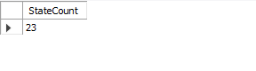
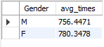
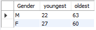
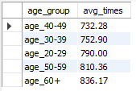
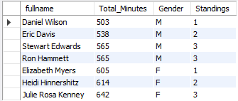
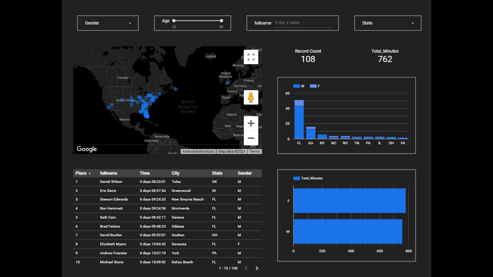

# Florida Forgotten Race Analysis
## Table of Contents
- [Project Overview](#project-overview)
- [Exploratory Questions](#exploratory-questions)
- [Skills Demonstrated](#skills-demonstrated)
- [Data Sources](#data-sources)
- [Tools Used](#tools-used)
- [Data Preparation](#data-preparation)
- [Data Analysis](#data-analysis)
- [Findings](#findings)

### Project Overview
---
This was an attempt to complete an end to end data analyst project using multiple tools(Python, MySQL, Excel, Looker Studio) as a means of improving my skills. It also aims to provide insights into the race performances of the different athletes that participated.
### Exploratory Questions
---
1. How many States were represented in the race?
2. What was the average of Men vs Women?
3. What were the youngest and oldest ages in the race?
4. What was the average time for each age group?
5. Top 3 males and females

### Skills Demonstrated
---
- Data cleaning in Excel
- Data analysis and preparation with Python
- Writing functional SQL queries
- Data Visualisation with Looker Studio
### Data Sources
---
The data used for this project can be found in the [cleanedupdata.csv](cleanedupdata.csv) file.
### Tools Used
---
- Microsoft Excel
- Python
- MySQL
- Looker Studio
### Data Preparation
---
- Removing unnecessary columns from the imported data in Excel.
- Adding the longitude and latitudes using geopy library for athlete locations in Python.
  
  ```python
  def get_lat_long(city, state):
    address = f"{city}, {state}"
    try:
        geolocator = Nominatim(user_agent="running", timeout=100)
        location = geolocator.geocode(address)
        if location:
            return location.latitude, location.longitude
        else:
            return None, None
    except GeocoderTimedOut:
        return None, None
  ```
- Creating a view in SQL for visualisation in Looker Studio
  
  ```sql
  CREATE VIEW vw_ff_50 AS
  SELECT fullname, Place, Time, Total_Minutes, City, State, Age, Gender, latlong
  FROM race_stats
  ```
## Data Analysis
**SQL**
---
1. How many States were represented in the race?
   
   ```sql
   SELECT COUNT(DISTINCT State) AS StateCount
   FROM race_stats;
   ```
   <p align="center">
     
   </p>
3. What was the average of Men vs Women?
   
   ```sql
   SELECT Gender, AVG(Total_Minutes) AS avg_times
   FROM race_stats
   GROUP BY Gender;
   ```
   <p align="center">
     
   </p>
5. What were the youngest and oldest ages in the race?
   
   ```sql
   SELECT Gender, MIN(Age) AS youngest, MAX(Age) AS oldest
   FROM race_stats
   GROUP BY Gender;
   ```
   <p align="center">
     
   </p>
7. What was the average time for each age group?
   
   ```sql
   WITH age_buckets AS
    (SELECT Total_Minutes,
	   CASE WHEN Age < 30 THEN 'age_20-29'
		 WHEN Age < 40 THEN 'age_30-39'
         WHEN Age < 50 THEN 'age_40-49'
         WHEN Age < 60 THEN 'age_50-59'
	   ELSE 'age_60+' END AS age_group
   FROM race_stats)
   SELECT age_group, ROUND(AVG(Total_Minutes), 2) AS avg_times
   FROM age_buckets
   GROUP BY age_group
   ORDER BY avg_times ASC;
   ```
   <p align="center">
     
   </p>
9. Top 3 males and females
    
   ```sql
   WITH top3 AS
    (SELECT 
	    fullname,
      Total_Minutes,
      Gender,
      RANK() OVER (PARTITION BY Gender ORDER BY Total_Minutes ASC) AS Standings
    FROM race_stats
   GROUP BY fullname, Total_Minutes, Gender)
   SELECT *
   FROM top3
   WHERE Standings <= 3
   ORDER BY Total_Minutes;
   ```
   <p align="center">
     
   </p>
**Looker Studio**

The screenshot below is the quick dashboard I created for the first time using Looker Studio. It offered a concise and simple way to bring dashboards and visualisations to life. It uses various controls(filters) as a means of providing interactivity in the dashboard as well as eye-catching charts for insights into the data provided.

<p align="center">
  
</p>

### Findings
---
Here are some insights I got through my analysis:

- There were 23 states represented in the race.
- On average, male athletes were faster than females in the race.
- The fastest athlete was Daniel Wilson with 8 hours 23 minutes and 1 second and the slowest athlete was Jonathan Burnham with 15 hours 40 minutes and 49 seconds.
- 108 athletes finished the race.
- The average athlete speed was 762 minutes(about 13 hours).
