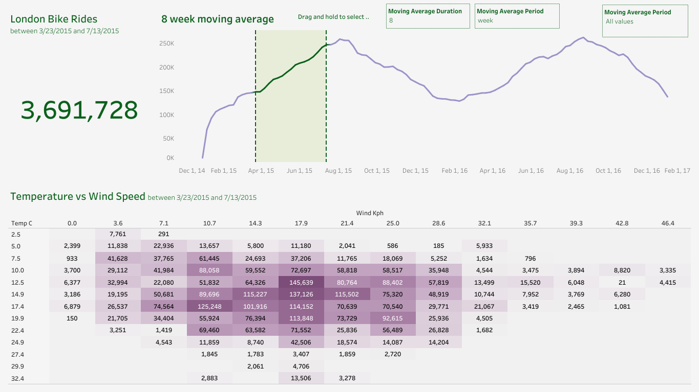

# London Bike Sharing
## Table of Contents
- [Project Overview](#project-overview)
- [Design Questions](#design-questions)
- [Skills Demonstrated](#skills-demonstrated)
- [Data Sources](#data-sources)
- [Tools Used](#tools-used)
- [Data Preparation](#data-preparation)
- [Data Analysis](#data-analysis)

### Project Overview
---
This was an attempt to complete an end to end data analyst project using multiple tools(Python and Tableau) as a means of improving my skills and to have a better understanding of the said tools.
### Design Questions
---
1. A means for a potential user to select through a set of dates
2. Selection of days of periods
3. Charts displaying insightful data
4. KPI(s)
### Skills Demonstrated
---
- Data Preparation with Python
- Data Visualisation with Tableau
- Critical Thinking and Problem Solving
### Data Sources
---
The data used can be found in the [london_bikes_final.xlsx](london_bikes_final.xlsx) file.
### Tools Used
---
- Jupyter Notebooks(Python)
- Tableau
### Data Preparation
---
- Data cleaning and renaming of some columns
  
  ```python
  # Renaming the original dataset columns
  new_col_names = {
    'timestamp': 'time',
    'cnt': 'count',
    't1': 'temp_real_C',
    't2': 'temp_feels_like_C',
    'hum': 'humidity_percent',
    'wind_speed': 'wind_speed_kph',
    'weather_code': 'weather',
    'is_holiday': 'is_holiday',
    'is_weekend': 'is_weekend',
    'season': 'season'
  }

  bikes.rename(new_col_names, axis='columns', inplace=True)
  ```
- Setting appropriate values for seasons and weather codes
  
  ```python
  # Setting appropriate values for seasons and weather codes using Map function
  seasons = {
    '0.0': 'Spring',
    '1.0': 'Summer',
    '2.0': 'Autumn',
    '3.0': 'Winter'
  }

  weather_dict = {
    '1.0':'Clear',
    '2.0':'Scattered clouds',
    '3.0':'Broken clouds',
    '4.0':'Cloudy',
    '7.0':'Rain',
    '10.0':'Rain with thunderstorm',
    '26.0':'Snowfall'
  }

  bikes["season"] = bikes["season"].astype(str)
  bikes["season"] = bikes["season"].map(seasons)

  bikes["weather"] = bikes["weather"].astype(str)
  bikes["weather"] = bikes["weather"].map(weather_dict)
  ```
**N.B**: Full data prep can be found in the [London_Bike_Sharing.ipynb](London_Bike_Sharing.ipynb) file.
### Data Analysis
---
<p align="center">
  
</p>

The image above is a snapshot of the dashboard I created. It features a dynamic KPI which identifies the total rides during a time range. It also uses a reference band and sets as a means to select a range of dates as well as parameters to select a moving average duration and period. Finally it features charts to dispaly specific insights into the data.
