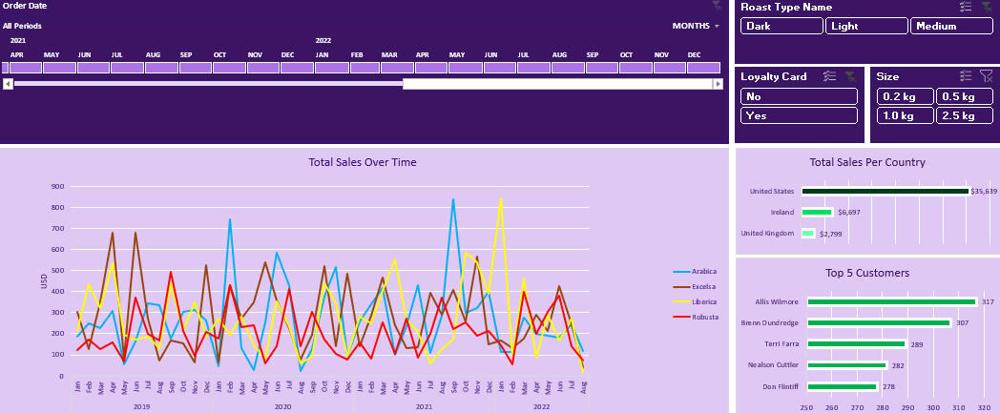

# Coffee Sales Analysis
## Table of Contents
- [Project Overview](#project-overview)
- [Exploratory Questions](#exploratory-questions)
- [Skills Demonstrated](#skills-demonstrated)
- [Data Sources](#data-sources)
- [Tools Used](#tools-used)
- [Data Cleaning](#data-cleaning)
- [Data Analysis](#data-analysis)
- [Findings](#findings)
- [Recommendations](#recommendations)

### Project Overview
---
This is a project done to help me improve my data analysis skills in Excel. It features a dataset about a fictional coffee shop that sells different types of coffee at different sizes and roasts. The aim of this project is to gain insights into the sales of each product and certain customer behaviour.
### Exploratory Questions
---
Here are some questions that served as a guide for insights:
1. What is best selling coffee type over the years?
2. Who are the top 5 customers in terms of money spent?
3. Sales by each country where the store is located?

### Skills Demonstrated
---
- Using Excel Functions(INDEX MATCH, XLOOKUP, IF)
- Creating interactive dashboards
- Using Pivot Tables, slicers etc.
- Critical Thinking and Problem Solving

### Data Sources
---
The data is contained in the [coffeeOrdersDashboard.xlsx](coffeeOrdersDashboard.xlsx) file along with the dashboard.
### Tools Used
---
- Microsoft Excel
### Data Cleaning
---
- Checking for duplicates
- Addressing empty cells in certian columns
- Fixing date and other datatypes
- Populating important columns using INDEX MATCH or XLOOKUP, IF etc.
## Data Analysis

  

### Findings
---

### Recommendations
---
