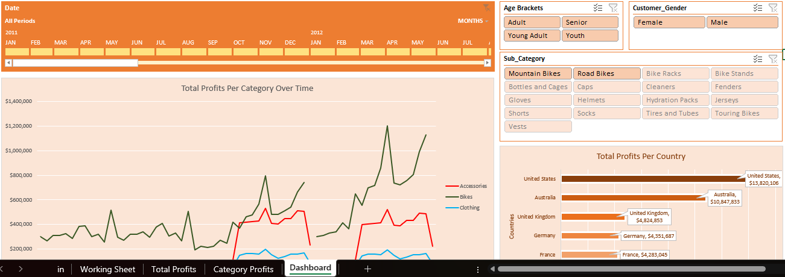

## EuroBike Sales Analysis
## Table of Contents
- [Project Overview](#project-overview)
- [Skills Demonstrated](#skills-demonstrated)
- [Data Sources](#data-sources)
- [Tools Used](#tools-used)
- [Data Cleaning](#data-cleaning)
- [Data Analysis](#data-analysis)
- [Findings](#findings)

### Project Overview
---
This data analysis project was carried out to help me improve my skills in data analytics primarily using Excel. I have done similar work on this dataset but using SQL. The main aim of this project was to try my hands on Excel and its features and in turn create a simple and visually-appealing dashboard. 
### Skills Demonstrated
---
- Using Pivot Tables
- Using Slicers and Timelines
- Dashboard Creation
- Critical Thinking and Problem solving
### Data Sources
---
The data used in contained within the [SalesDashboard.xlsx](SalesDashboard.xlsx) file.
### Tools Used
---
- Microsoft Excel
### Data Cleaning
---
- The data was clean but there were errors with the original revenue and profits column. I solved this by recalculating them using:
- order_quantity * unit_price = revenue
- revenue - (order_quantity * unit_cost) = profits
### Data Analysis
---

  

### Findings
---
As said in the overview, I have worked with this dataset before so findings can be found here. The only difference is during the SQL analysis, there were issues with data importation so this analysis with Excel has the complete data therefore has more accurate values
