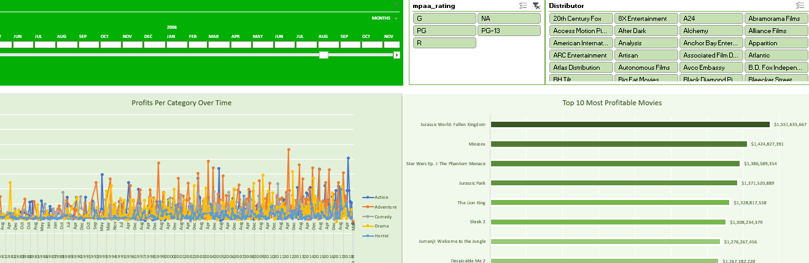
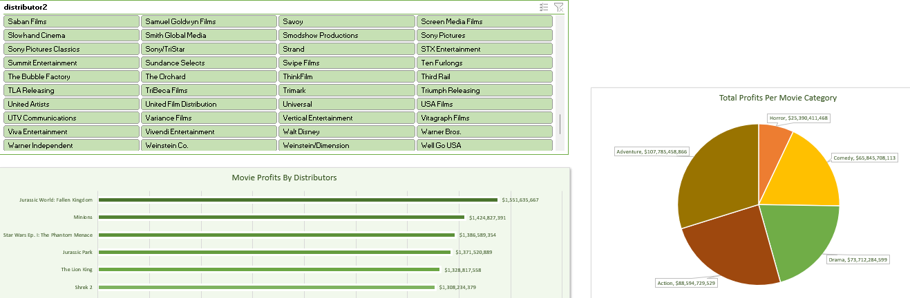

# Movie Profits Analysis
## Table of Contents
- [Project Overview](#project-overview)
- [Exploratory Questions](#exploratory-questions)
- [Skills Demonstrated](#skills-demonstrated)
- [Data Sources](#data-sources)
- [Tools Used](#tools-used)
- [Data Cleaning](#data-cleaning)
- [Data Analysis](#data-analysis)
- [Findings](#findings)

### Project Overview
---
This is a project done to help me improve my data analysis skills in Excel. It features a dataset containing movies released by different distributors as well as their budgets, worldwide and domestic gross earnings. The project aimed at discovering patterns and insights that existed within the data and presenting them in an interactive dashboard.
### Exploratory Questions
---
Before I started the analysis, I asked these questions as guides to potentially find insights:
1. How has each genre performed in terms of profits over the years?
2. What are the most profitable movies of all time?
3. Who are the most successful distributors of all time?
4. What genres do distribitors make the most money from?
### Skills Demonstrated
---
- Using Pivot Tables
- Using Slicers and Timelines
- Dashboard Creation
- Critical Thinking and Problem solving
### Tools Used
---
- Microsoft Excel
### Data Sources
---
The data is contained in the [movie_profits1.xlsx](movie_profits1.xlsx) file along with the dashboard.
### Data Cleaning
---
I calculated for net profits as a great indicator for how truly successful a movie was. It was calculated by
- (worldwide gross + domestic gross) - production budget = net profits
## Data Analysis

  

The above screenshot represents the first half of the dashboard where a timeline, slicers and charts can be seen. The slicers are used for interactivity and can filter the data displayed on the charts as well in order to bring forth specific information. E.g: If the PG-13 and 20th Century Fox buttons are clicked, both charts change to display profits of genres distributed by 20th century Fox as well as just PG-13 rated and the second chart shows the top 10 most profitable PG-13 movies made by 20th Century Fox.

  

The screenshot above shows the second part of the dashboard which focuses on the distributors. It shows a slicer for filtering their most succesful movies as well as well the genre splits and their contributions to their overall profits.

### Findings
---
- From the data, the distributor making the most profits is **Universal Pictures** with profits **$54,269,923,767**.
- The most successful movie is **Jurassic World: Fallen Kningdom** with profits of **$1,551,635,667**.
- The success of genres in terms of profits is as follows:
  - **Horror** with	**$25,390,411,468**
  - **Comedy** with	**$65,845,708,113**
  - **Drama** with **$73,712,284,599**
  - **Action** with	**$88,594,729,529**
  - **Adventure** with **$107,785,458,866**
