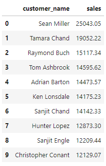
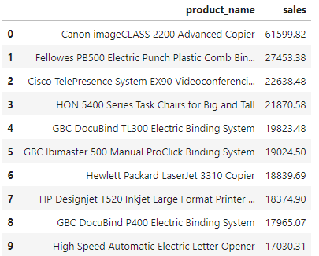
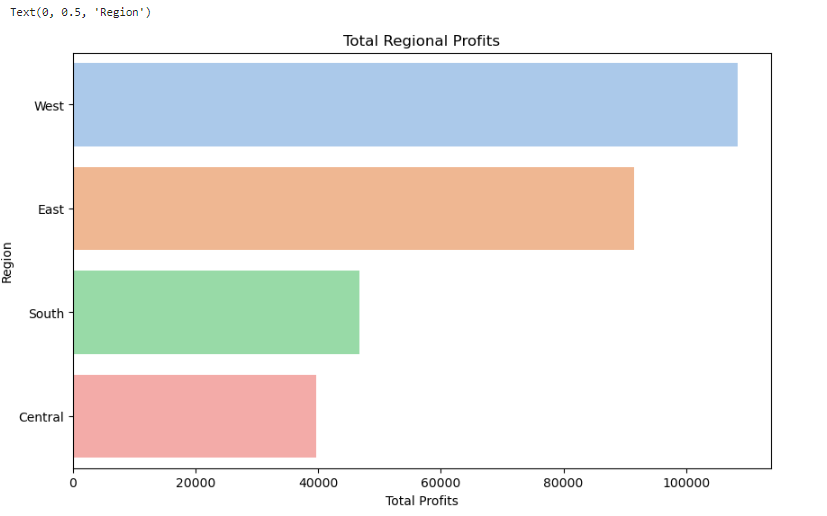
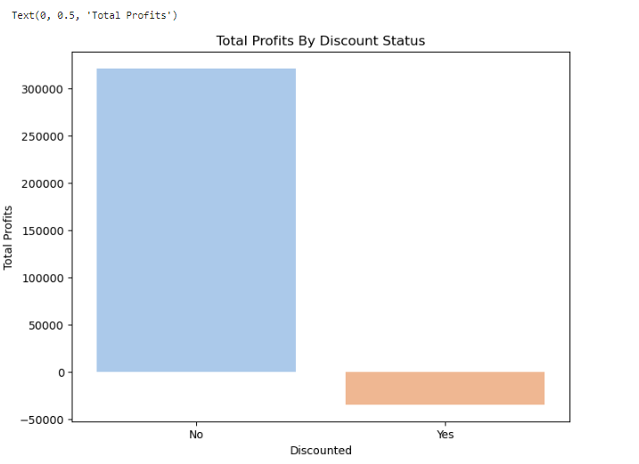
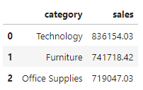
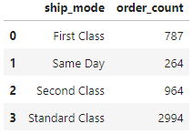

# Superstore Performance Analysis
## Table of Contents
- [Project Overview](#project-overview)
- [Exploratory Questions](#exploratory-questions)
- [Skills Demonstrated](#skills-demonstrated)
- [Data Sources](#data-sources)
- [Tools Used](#tools-used)
- [Data Cleaning](#data-cleaning)
- [Data Analysis](#data-analysis)
- [Findings](#findings)
- [Summary](#summary)
- [Recommendations](#recommendations)
### Project Overview
---
This is a data analysis project done using Python with the aim of improving my data cleaning, exploration and visualisation skills using Python libraries like Pandas, Matplotlib and Seaborn. It also aims to provide insights into the sales and profit performances of a fictional superstore that sells various items. By understanding the patterns that exist within the data through proper analysis, appropriate recommendations were made that could potentially improve profitability.
### Exploratory Questions
---
The aim was to add further insightful questions that stem from these groups that could provide more information for the analysis:
1. Sales & Profits From Customers
2. Product Performances
3. Regional Sales & Profits
4. Discount Impact on Sales & Profits
5. Category/Subcategory Performances
6. Ship Mode & Shipping durations
### Skills Demonstrated
---
- Problem Solving
- Critical Thinking
- Data Cleaning & Visualisation with Python
### Data Sources
---
The data used can be found in the [Sample-Superstore](Sample-Superstore.xlsx) file.
### Tools Used
---
- Jupyter Notebooks
### Data Cleaning
---
- Checking for nulls and duplicates and dropping them where necessary.
- Renaming and adding columns where necessary.
- Fixing datatypes of columns
## Data Analysis
This section covers a glimpse of some of the code I wrote as well as some screenshots and a brief summary of the general findings I was able to extract through my analysis. 

**N.B**: The complete code and visualisations can be found in the [Superstore_EDA.ipynb](Superstore_EDA.ipynb) file
### Findings
---
1. Sales & Profits From Customers
   - Top 10 Customers - Total Money Spent(Sales)
     ```python
     # Querying for the top 10 customers who spent the most money
     customer_sales = store_data.groupby("customer_name")["sales"].sum().sort_values(ascending=False).reset_index()
     top10 = customer_sales.head(10)
     top10
     ```
     <p align="center">
        
     </p>
2. Product Performances
   - Best Selling Products
     ```python
     # Querying the data to get the top 10 best selling products
     product_sales = store_data.groupby("product_name")["sales"].sum().sort_values(ascending=False).reset_index()
     prodsales_top10 = product_sales.head(10)
     prodsales_top10
     ```
     <p align="center">
        
     </p>
3. Regional Sales & Profits
   - Total Profits from each Region
     ```python
     # Horizontal bar chart displaying the profit data
     plt.figure(figsize=(10,6))
     sns.barplot(y="region", x="profit", data=region_profits, palette='pastel')
     plt.title("Total Regional Profits")
     plt.xlabel("Total Profits")
     plt.ylabel("Region")
     ```
     <p align="center">
        
     </p>
4. Discount Impact on Sales & Profits
   - Discount Impact on Sales & Profits
     ```python
     # Plotting a bar chart to display the data
     plt.figure(figsize=(8,6))
     sns.barplot(x="discounted", y="profit", data=discounted_profits, palette='pastel')
     plt.title("Total Profits By Discount Status")
     plt.xlabel("Discounted")
     plt.ylabel("Total Profits")
     ```
     <p align="center">
        
     </p>
5. Category/Subcategory Performances
    - Total Sales For Each Category
      ```python
      # Querying for the total sales from each category
      cat_sales = store_data.groupby("category")["sales"].sum().sort_values(ascending=False).reset_index()
      cat_sales
      ```
      <p align="center">
        
     </p>
6. Ship Mode & Shipping durations
    - Order count for each Ship Mode
      ```python
      # Extracting the order count for each ship mode
      shipmode_order_count = store_data.groupby("ship_mode")["order_id"].nunique().reset_index(name="order_count")
      shipmode_order_count
      ```
      <p align="center">
        
     </p>
### Summary
---
- The **customer** with the **most money spent(sales)** is **Sean Miller** with a figure of **$25,043.05**. The customer with the **most orders** is **Emily Phan** with **17** and the customer that ordered the **most items(quantity)** is **Jonathan Doherty** with **150 units**.
- The **product** with the **highest sales** is the **Canon imageCLASS 2200 Advanced Copier** with a figure of	**$61,599.82**. The product generating the **most profits** is still the **Canon Advanced Copier** with profits of **$25,199.93**. The **most ordered product** in terms of quantity is **Staplers** with a quantity of **215 units**.
- The **best performing region** in terms of **sales and profits and quantity** ordered is the **West** with figures of **$725,457.82, $108,418.45 and 12,266 units** respectively. The **worst for sales** is the **South** with sales of **$391,721.91**. The **worst in terms of profits** is the **Central** with profits of **$39,706.36** and the **worst in terms of quantity** is the **South** with a value of **6209 units**.
- With regards to the **impact of discounts on sales**, there are higher sales when there are discounts applied with a figure of **$1,209,011.02** compared to a value of **$1,087,908.47** when they are not. On the otherhand, **profits** are much higher when there are no discounts than when there are discounts with figures of **$320,987.60** and **-$34,578.52** respectively.
- The **best performing category** in terms of **sales and profits** is **Technology** with figures of **$836,154.03 and $145,454.95** respectively but the best in terms of **quantity** is **Office Supplies** with **22,906 units**. The **worst for sales** is **Office Supplies** with sales of **$719,047.03**. The **worst in terms of profits** is **Furniture** with profits of **$18,463.33** and the **worst in terms of quantity** is **Technology** with a value of **6939 units**.
- The **best performing subcategory** in terms of **sales** is **Phones** with a value of **$330,007.05**, in terms of **profits** the best performer is **Copiers** with a value of **$55,617.82** and the best performer in terms of **quantity ordered** is **Binders** with a quantity of **5974 units**. On the flip side for **sales**, **Fasteners** are the **lowest** performers with **$3,024.28**. For **profits**, **Tables** are the biggest losers with a value of **-$17,725.48** and finally for **quantity ordered**, **Copiers** were the lowest with **234 units**.
- Most **orders** were **shipped** through **Standard Class** mode with the mode having **2994 orders** shipped that way. **Same day** had the **least** orders with **264 orders**.
- With **average shipping durations**, **Same day** had the **shortest** duration of **0.04 days** which makes sense since orders arrive the same day. **Standard Class** had the **longest** wait time of about **5 days**.
- With regards to **segments**, The **Consumer** segment contributes about **50.6%** to the **sales**, **Corporate** contributes about **30.7%** and **Home Office** with about **18.7%**.
- Finally with **State** performances, **California** leads in **sales, profits and quantity ordered** with figures of **$457,687.63, $76,381.39 and 7667 units** respectively. For the worst performers. **North Dakota** had the **lowest sales** with **$919.91**, **Texas** had the **lowest profits** with **-$25,729.36** and for **quantity ordered**, **Wyoming** had **4 units**.
### Recommendations
---
Based on my analysis, here are some recommendations I would offer to the Superstore:
1. **State-specific Strategies**: Leverage the strong performance in California and explore strategies that contributed to its success. For underperforming states like North Dakota, Texas, and Wyoming, assess market conditions, customer behaviors, and competition to identify potential improvements.
2. **Category and Subcategory Focus**: Since the Technology category performs well in sales and profits, consider expanding the product range within this category or investing in additional marketing efforts. Evaluate underperforming categories like Furniture and Fasteners to identify improvement opportunities.
3. **Regional Market Strategies**: Given that the West region outperforms others, consider allocating additional resources, marketing efforts, or tailored strategies to further boost sales and profits in this region. Identify specific factors contributing to success in the West for potential replication in other regions.
4. **Discount Strategy Review**: Evaluate the impact of discounts on profits. If discounts are negatively affecting profits, consider adjusting the discount strategy, possibly by targeting specific products or customer segments for discounts to maximize overall profitability.
5. **Customer Engagement and Loyalty Programs**: Identify ways to engage with high-spending customers like Sean Miller, such as exclusive promotions, loyalty programs, or personalized offers to encourage repeat business.
