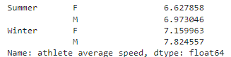
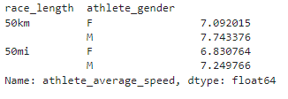
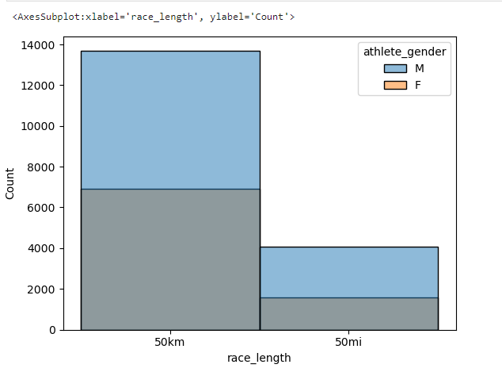
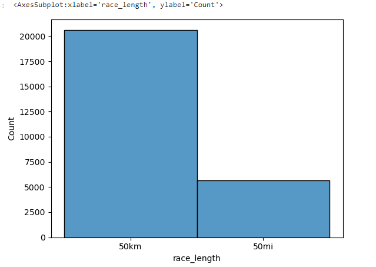

# Ultra Marathon Races Analysis
## Table of Contents
- [Project Overview](#project-overview)
- [Exploratory Questions](#exploratory-questions)
- [Skills Demonstrated](#skills-demonstrated)
- [Data Sources](#data-sources)
- [Tools Used](#tools-used)
- [Data Cleaning](#data-cleaning)
- [Data Analysis](#data-analysis)
- [Findings](#findings)
- [Summary](#summary)
- [Limitations](#limitations)
### Project Overview
---
This is my first data analysis project using just Python so it was done to help me improve my data cleaning, exploration and visualisation skills using Python libraries like Pandas, Matplotlib and Seaborn. The project aims to just perform some exploratory analysis on a dataset of Ultra Marathon races run across the world.
### Exploratory Questions
---
Here are some interesting questions I asked to get some insights into the data provided:
1. Are athletes slower in summer than in winter?
2. What is the difference in speed for 50km and 50mi, male to female?
3. What is the gender participation like for both races?
4. What race is run more between the two races considered?

**N.B**: More questions were used to further analysis.
### Skills Demonstrated
---
- Data cleaning with Pandas
- Data visualisations with Seaborn & Matplotlib
- Critical Thinking & Problem Solving
### Data Sources
---
I found the dataset on Kaggle here.
### Tools Used
---
- Jupyter Notebooks
### Data Cleaning
---
- Dropped duplicates and nulls
- Fixing column datatypes
- Dropped unnecessary columns
- Renamed and added columns appropriately
## Data Analysis
This section covers a glimpse of some of the code I wrote as well as some screenshots and a brief summary of the general findings I was able to extract through my analysis.

**N.B**: The Notebook can be found in the [UltraMarathon_EDA(Pandas and Seaborn).ipynb](UltraMarathon_EDA(Pandas and Seaborn).ipynb) file
### Findings
---
1. Are athletes slower in summer than in winter?
   ```python
   races.groupby("race_season")["athlete_average_speed"].mean()
   ```
   <p align="center">
      
   </p>
2. What is the difference in speed for 50km and 50mi, male to female?
   ```python
   races.groupby(["race_length","athlete_gender"])["athlete_average_speed"].mean()
   ```
   <p align="center">
      
   </p>
3. What is the gender participation like for both races?
   ```python
   # Creating a histogram to highlight gender participation in each race type
   sns.histplot(data=races, x='race_length', hue='athlete_gender')
   ```
   <p align="center">
      
   </p>
4. What race is run more between the two races considered?
   ```python
   # Creating a histogram for race length frequency
   sns.histplot(races["race_length"])
   ```
   <p align="center">
      
   </p>
### Summary
---
### Limitations
---
