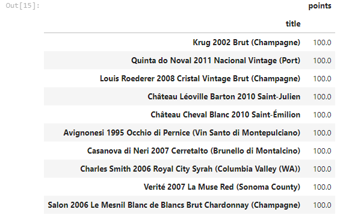
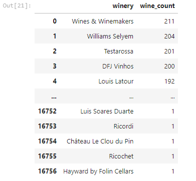
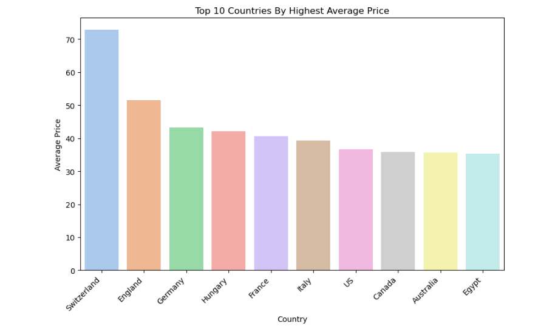
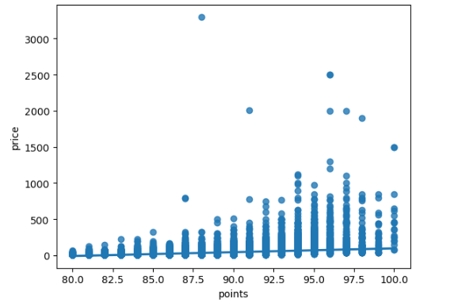
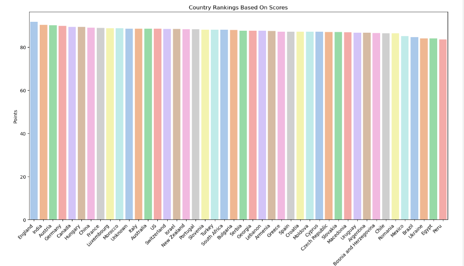

# Wine Reviews Analysis
## Table of Contents
- [Project Overview](#project-overview)
- [Exploratory Questions](#exploratory-questions)
- [Skills Demonstrated](#skills-demonstrated)
- [Data Sources](#data-sources)
- [Tools Used](#tools-used)
- [Data Cleaning](#data-cleaning)
- [Data Analysis](#data-analysis)
- [Findings](#findings)
- [Summary](#summary)

### Project Overview
---
This is a data analysis project done using Python with the aim of improving my data cleaning, exploration and visualisation skills using Python libraries like Pandas, Matplotlib and Seaborn. It also aims to provide insights into the ratings of wines, prices, wineries and so on.

### Exploratory Questions
---
The aim was to ask insightful questions that could provide more information for the analysis:
1. What are the top 10 highest-rated wines in the dataset?
2. How many wines were produced by each winery?
3. Top 10 countries with the highest average wine prices.
4. Is there a relationship between wine ratings (points) and prices?
5. What are the countries with the best rated wines?

### Skills Demonstrated
---
- Problem Solving
- Critical Thinking
- EDA, Data Cleaning & Visualisation with Python

### Data Sources
---
The data used can be found in the zip folder.

### Tools Used
---
- Jupyter Notebooks

### Data Cleaning
---
- Checking for nulls and duplicates and dropping them where necessary.
- Filling nulls with appropriate types

## Data Analysis
This section covers a glimpse of some of the code I wrote as well as some screenshots and a brief summary of the general findings I was able to extract through my analysis. 

**N.B**: The complete code and visualisations can be found in the [Wine_Reviews.ipynb](Wine_Reviews.ipynb) file

### Findings
---
1. What are the top 10 highest-rated wines in the dataset?
   ```python
   reviews.groupby("title")["points"].mean().sort_values(ascending=False).to_frame().head(10)
   ```
   <p align="center">
        
   </p>
2. How many wines were produced by each winery?
   ```python
   reviews.groupby("winery")["title"].size().sort_values(ascending=False).reset_index(name="wine_count")
   ```
   <p align="center">
        
   </p>
3. Top 10 countries with the highest average wine prices.
   ```python
   top10 = reviews.groupby("country")["price"].mean().sort_values(ascending=False).reset_index().head(10)
   top10
   # Plotting the bar chart
   plt.figure(figsize=(10,6))
   sns.barplot(x="country", y="price", data=top10, palette="pastel")
   plt.title("Top 10 Countries By Highest Average Price")
   plt.xlabel("Country")
   plt.ylabel("Average Price")
   plt.xticks(rotation=45, ha='right');
   ```
   <p align="center">
        
   </p>
4. Is there a relationship between wine ratings (points) and prices?
   ```python
   sns.regplot(x="points", y="price", data=reviews)
   ```
   <p align="center">
        
   </p>
5. What are the countries with the best rated wines?
   ```python
   best_rated = reviews.groupby("country")["points"].mean().sort_values(ascending=False).reset_index()
   best_rated

   plt.figure(figsize=(16,8))
   sns.barplot(x="country",y="points", data=best_rated, palette="pastel")
   plt.title("Country Rankings Based On Scores")
   plt.xlabel("Country")
   plt.ylabel("Points")
   plt.xticks(rotation=45, ha='right');
   ```
   <p align="center">
        
   </p>
### Summary
---
- There are at least 10 **wines** with a **perfect score of 100** such as the **Krug 2002 Brut (Champagne)** etc.
- **Wines & Winemakers** is the **winery** that has produced the most wines while wineries like **Hayward by Follin Cellars**, **Ricordi** etc. have each produced just **1** wine.
- On average, **Switzerland** has the **most expensive** wines with a price of **$72.8**
- There is **weak positive correlation** between **wine points** and the **price** which means in some cases, a high rating would imply an equally high price but that is not always the case.
- **England** has the **best rated** wines with an average points rating of **91.75** while **Peru** has the **least rated** wines with an average rating of **83.56**
- The **province** with the **highest price** of wines is **Corales** with avergae prices of **$262.5** while the province with the **cheapest** wines is **Viile Timisului** with prices of **$7.5**
- The **wine taster** with the **most reviews** is **Roger Voss** while the taster with the **least reviews** is **Christina Pickard**.
