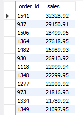
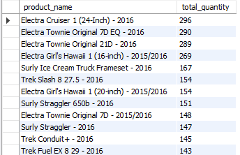
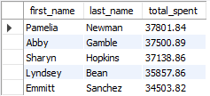
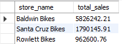
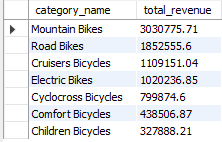

# Bike Store Sales Analysis

## Table of Contents
- [Project Overview](#project-overview)
- [Potential Questions](#potential-questions)
- [Skills Demonstrated](#skills-demonstrated)
- [Data Sources](#data-sources)
- [Tools Used](#tools-used)
- [Data Cleaning](#data-cleaning)
- [Data Analysis](#data-analysis)
- [Findings](#findings)
- [Summary](#summary)
- [Recommendations](#recommendations)

### Project Overview
---
This data analysis project was carried out to help me improve my SQL querying skills. It also aims to provide insights into the sales performance of stores that sell a variety of bikes. By identifying purchase trends in customers and products, data-driven decisions and recommendations can be made as well as acquiring an understanding of store performances. 

### Potential Questions
---
After browsing through the data, some interesting question groupings that can provide clarity initially came to my mind:
1. Sales and Revenue Analysis 
2. Product and Inventory Analysis
3. Customer Behaviour and Order Analysis
4. Staff and Store Analysis
5. Product Category and Brand Analysis

**N.B**: More questions were added and answered when the data is queried

### Skills Demonstrated
---
- Writing functional & efficient SQL queries

### Data Sources
---
The data used for the analysis can be found in the Data folder in csv files.

### Tools Used
---
- MySQL

### Data Cleaning
---
The data was already relatively clean and ready to use.

## Data Analysis
This section covers a glimpse of some of the queries I wrote as well as a brief summary of the general findings I was able to extract through my analysis:

**N.B**: All the queries I wrote can be found in the [Bike Queries](bike_queries.sql) file

### Findings
---
1. **Sales and Revenue Analysis**:
   - What are the total sales for each order?
     ```sql
     SELECT o.order_id, ROUND(SUM(oi.list_price * oi.quantity), 2) AS sales
     FROM orders o
     JOIN order_items oi ON o.order_id = oi.order_id
     GROUP BY o.order_id
     ORDER BY sales DESC;
     ```
     <p align="center">
      
     </p>
2. **Product and Inventory Analysis**:
   - What are the quantities of each product ordered?
     ```sql
     SELECT p.product_name, SUM(oi.quantity) AS total_quantity
     FROM order_items oi 
     JOIN products p ON oi.product_id = p.product_id
     GROUP BY p.product_name
     ORDER BY total_quantity DESC;
     ```
     <p align="center">
      
     </p>
4. **Customer Behaviour and Order Analysis**:
   - Which customers have spent the most on their orders(top 5)?
     ```sql
     SELECT c.first_name, c.last_name, ROUND(SUM(oi.list_price * oi.quantity), 2) AS total_spent
     FROM customers c 
     JOIN orders o ON c.customer_id = o.customer_id
     JOIN order_items oi ON o.order_id = oi.order_id
     GROUP BY c.first_name, c.last_name
     ORDER BY total_spent DESC
     LIMIT 5;
     ```
     <p align="center">
      
     </p>
6. **Staff and Store Analysis**:
   - How is each store doing in terms of total revenues?
     ```sql
     SELECT s.store_name, ROUND(SUM(oi.list_price * oi.quantity), 2) as total_sales
     FROM orders o 
     JOIN order_items oi ON o.order_id = oi.order_id
     JOIN stores s ON o.store_id = s.store_id
     GROUP BY s.store_name
     ORDER BY total_sales DESC;
     ```
     <p align="center">
      
     </p>
8. **Product Category and Brand Analysis**:
   - What are the total revenues generated by each product category?
    ```sql
    SELECT c.category_name, ROUND(SUM(oi.list_price * oi.quantity), 2) AS total_revenue
    FROM orders o 
    JOIN order_items oi ON o.order_id = oi.order_id
    JOIN products p ON oi.product_id = p.product_id
    JOIN categories c ON p.category_id = c.category_id
    GROUP BY c.category_name
    ORDER BY total_revenue DESC;
    ```
    <p align="center">
      
     </p>

### Summary
- The most successful **year** was **2017** with a revenue of **$3,845,515.02**.
- The **customer** who spent the most money on orders was **Pamelia Newman** with a total spend of **$38,702**.
- The **store** bringing in the most revenue is **Baldwin Bikes** with a revenue of **$5,826,242.21** follwed by **Santa Cruz Bikes** with **$1,790,145.91** and **Rowlett Bikes** with **$962,600.76**
- The **sales rep** accounting for the most revenue through sales is **Marcelene Boyer** with a generated revenue of **$2,938,889**.
- The most popular **brand** is **Trek** with a revenue of **$5,129,382** and the least poular is **Strider** with a revenue of **$4,850** and the **category** generating the most revenue is **Mountain Bikes** with a revenue of **$3,030,776** and the leat generating categoty is **Children Bikes** with a revenue of **$327,888**.
- The **state** generating the most revenue is **NY** with a revenue of **$5,826,242.21** then **CA** with **$1,790,145.91** and finally **TX** with **$962,600.76**

### Recommendations
---
Based on the data insights I gathered, I have offered these recommendations:

1. **Focus on Successful Years:** Given that 2017 was the most successful year with the highest revenue, consider analyzing the factors that contributed to this success. Explore whether specific products, marketing strategies, or external factors played a role.

2. **Customer Engagement:** Recognize and appreciate high-spending customers like Pamelia Newman. Consider implementing loyalty programs, special promotions, or personalized marketing to maintain and increase engagement with such valuable customers.

3. **Store Performance:** Baldwin Bikes was the top-performing store in terms of revenue. Investigate the reasons behind its success, such as location, product assortment, or customer service. Implement successful strategies from Baldwin Bikes in other stores to potentially increase revenue.

4. **Sales Representative Performance:** Acknowledge and reward high-performing sales representatives like Marcelene Boyer. She could share best practices and successful sales strategies across the sales team to improve overall performance.

5. **Brand and Category Strategy:** Recognize the popularity of the Trek brand and the profitability of the Mountain Bikes category. Consider strengthening marketing efforts, expanding product lines, or negotiating better deals with Trek to maximize revenue. Evaluate the potential for improving the performance of less popular brands and categories.

6. **Regional Expansion:** Given that NY is the top revenue-generating state, explore opportunities for expanding operations or marketing efforts in this region. Identify factors contributing to success in NY and apply them to other states, especially those with lower revenue.

