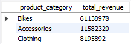
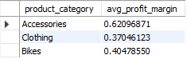
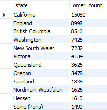
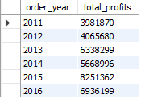
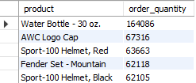

# European Bike Store Sales
## Table of Contents
### Project Overview
---
This data analysis project was carried out to help me improve my skills in data analytics. It also aims to provide insights into the sales performance of a fictional European bike comapny that sells bikes, clothing and other accessories to multiple countries across the world. By understanding the patterns that exist within the data through proper analysis, appropriate recommendations were made that could potentially improve profitability. 
### Exploratory Questions
---
These question groups were formulated after getting a brief understanding of the data. The aim was to add further insightful questions that stem from these groups that could provide more information for the analysis:
1. Revenue Analysis
2. Pricing & Cost Analysis
3. Customer and Order Analysis
4. Yearly Analysis
5. Product and Country Analysis

### Skills Demonstrated
---
- Critical thinking
- Problem solving
- Wrting functional SQL queries

### Data Sources
---
The data can be found in the Sales.csv file

### Tools Used
---
- MySQL
- Microsoft Excel

### Data Cleaning
---
The data was clean but there were errors with the original revenue and profits column. I solved this by recalculating them using:
- order_quantity * unit_price = revenue
- revenue - (order_quantity * unit_cost) = profits

## Data Analysis
This section covers a glimpse of some of the queries I wrote as well as a brief summary of the general findings I was able to extract through my analysis:

### Findings
---
1. Revenue Analysis:
   - What are the total revenues generated for each product category?
     ```sql
     SELECT product_category, SUM(revenue) AS total_revenue
     FROM sales
     GROUP BY product_category
     ORDER BY total_revenue DESC;
     ```
     <p align="center">
      
     </p>
3. Pricing & Cost Analysis:
   - What are the average profit margins for each product category?
     ```sql
     SELECT product_category, AVG(profits / revenue) AS avg_profit_margin
     FROM sales
     GROUP BY product_category;
     ```
     <p align="center">
      
     </p>
5. Customer and Order Analysis:
   - What were the total order quantities for each state?
     ```sql
     SELECT state, COUNT(*) AS order_count
     FROM sales
     GROUP BY state
     ORDER BY order_count DESC
     ```
     <p align="center">
      
     </p>
7. Yearly Analysis:
   - What were the total profits for each year.
     ```sql
     SELECT YEAR(date) AS order_year, SUM(profits) AS total_profits
     FROM sales
     GROUP BY order_year
     ORDER BY order_year;
     ```
     <p align="center">
      
     </p>
9. Product and Country Analysis:
    - What were the top 5 products with the highest total order quantity?
      ```sql
      SELECT product, SUM(order_quantity) AS order_quantity
      FROM sales
      GROUP BY product
      ORDER BY order_quantity DESC
      LIMIT 5;
      ```
      <p align="center">
      
     </p>
### Summary
---
### Recommendataions
---
