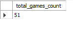
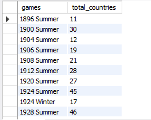
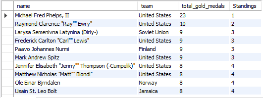
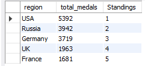

# Olympic Games Analysis
## Table of Contents
- [Project Overview](#project-overview)
- [Exploratory Questions](#exploratory-questions)
- [Skills Demonstrated](#skills-demonstrated)
- [Data Sources](#data-sources)
- [Tools Used](#tools-used)
- [Data Cleaning](#data-cleaning)
- [Data Analysis](#data-analysis)
- [Findings](#findings)
- [Summary](#summary)
- [Limitations](#limitations)
### Project Overview
---
This data analysis project was carried out to help me improve my skills in data analytics specifically practicing more advanced SQL queries and concepts like advanced JOINS, CTEs and SUBQUERIES. The aim of this project was primarily for skill improvement but some insights found were also shared.
### Exploratory Questions
---
Here are some interesting questions I asked to get some insights into the data provided:
1. How many olympics games have been held?
2. What is the total number of nations who participated in each olympics game?
3. Who are the top 5 athletes who have won the most gold medals.
4. What are the top 5 most successful countries in olympics in terms of medals won?
   
**N.B**: More questions were used to further analysis.
### Skills Demonstrated
---
- Critical thinking
- Problem solving
- Writing more advanced SQL queries

### Data Sources
---
The data used can be found in the [Data.zip](Data.zip) folder.
### Tools Used
---
- MySQL
### Data Cleaning
---
The data was already relatively clean and ready to use.
## Data Analysis
This section covers a glimpse of some of the queries I wrote as well as some screenshots and a brief summary of the general findings I was able to extract through my analysis:

**N.B**: All the code I wrote can be found in the [olympicos.sql](olympicos.sql) file
### Findings
---
1. How many olympics games have been held?
   ```sql
   SELECT COUNT(*) as total_games_count
   FROM
   (SELECT year, season
   FROM athlete_events
   GROUP BY year, season
   ORDER BY year) s;
   ```
   <p align='center'>
     
   </p>
3. What is the total number of nations who participated in each olympics game?
   ```sql
   SELECT games, COUNT(region) AS total_countries
   FROM
	  (SELECT games, region
	  FROM athlete_events a 
	  JOIN noc_regions n ON n.noc = a.noc
	  GROUP BY games, region
	  ORDER BY games) c
   GROUP BY games
   ORDER BY games;
   ```
   <p align='center'>
     
   </p>
5. Who are the top 5 athletes who have won the most gold medals.
   ```sql
   With GoldRankings AS (SELECT 
	    name, 
      team, 
      total_gold_medals,
      DENSE_RANK() OVER(ORDER BY total_gold_medals DESC) Standings
   FROM 
	    (SELECT name, team, COUNT(medal) AS total_gold_medals
	    FROM athlete_events
	    WHERE medal = 'Gold'
	    GROUP BY name, team
	    ORDER BY total_gold_medals DESC) c)
   SELECT *
   FROM GoldRankings
   WHERE Standings BETWEEN 1 AND 5;
   ```
   <p align='center'>
     
   </p>
7. What are the top 5 most successful countries in olympics in terms of medals won?
   ```sql
   With MedalCount AS 
	  (SELECT region, COUNT(medal) as total_medals
	  FROM athlete_events a 
	  JOIN noc_regions n ON a.noc = n.noc
	  WHERE medal IN ('Gold', 'Silver', 'Bronze')
	  GROUP BY region
	  ORDER BY total_medals DESC)
   SELECT 
	  region, 
    total_medals,
    RANK() OVER (ORDER BY total_medals DESC) Standings
   FROM MedalCount
   LIMIT 5;
   ```
   <p align='center'>
     
   </p>
### Summary
---
- There have been about 51 games held in total.
- The United States has the most medals in total with 5392 medals.
- Michael Phelps has the most gold medals of all time with 23 golds.
- Michael Phelps also has the most medals in total with 28.
- The oldest olympic athletes to win gold are Charles Jacobus and Oscar Gomer Swahn at 64 years of age.
- The youngest athletes to win gold all at age 13 are: 
  - Hans Bourquin
  - Donna Elizabeth de Varona
  - Fu Mingxia
  - Marjorie Gestring
  - Kim Yun-Mi
  - Aileen Muriel Riggin
  - Klaus Zerta
- From the data, Switzerland and UK have participated in all games.
- Some countries that have never won a gold medal: Ghana, Qatar, Kuwait, Saudi Arabia, Niger, Botswana, Guyana etc.

### Limitations
---
I had slight problems initially importing all the rows of that dataset but it was about 95% complete but I have since figured out the problem and the solution to that.
