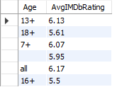
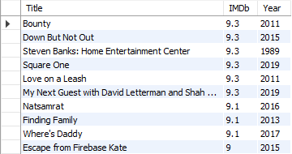
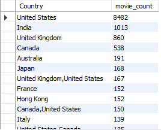
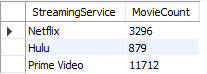

# Streaming Platforms Analysis
## Table of Contents
- [Project Overview](#project-overview)
- [Exploratory Questions](#exploratory-questions)
- [Skills Demonstrated](#skills-demonstrated)
- [Data Sources](#data-sources)
- [Tools Used](#tools-used)
- [Data Cleaning](#data-cleaning)
- [Data Analysis](#data-analysis)
- [Findings](#findings)
- [Summary](#summary)

### Project Overview
---
This was one of my earlier data analysis projects and it was carried out to help me improve my skills in data analytics with regards to SQL. The aim of this project was to query the data about movies on streaming platforms such as Netflix, Hulu, PrimeVideo and Disney+ and find interesting insights contained in it.
### Exploratory Questions
---
1. What is the average IMDB rating for each age group?
2. What is the longest movie available?
3. What are the top 10 movies with the highest IMDb ratings?
4. How many movies have been released across the various countries?
5. What is the total number of movies available on each streaming service (Netflix, Hulu, Prime Video, Disney+)
### Skills Demonstrated
---
- Critical Thinking
- Problem Solving
- Writing functional SQL queries
### Data Sources
---
The data can be found in the [MoviesOnStreamingPlatforms_updated.csv](MoviesOnStreamingPlatforms_updated.csv) file
### Tools Used
---
- MySQL
### Data Cleaning
---
The data was relatively clean and ready to use.
## Data Analysis
This section covers a glimpse of some of the queries I wrote as well as some screenshots and a brief summary of the general findings I was able to extract through my analysis.

**N.B**: All the queries I wrote can be found in the [streaming.sql](streaming.sql) file.
### Findings
---
1. What is the average IMDB rating for each age group?
   ```sql
   SELECT Age, ROUND(AVG(IMDb), 2) AS AvgIMDbRating
   FROM movies
   GROUP BY Age;
   ```
   <p align="center">
      
   </p>
3. What is the longest movie available?
   ```sql
   SELECT *
   FROM movies
   WHERE Runtime = (SELECT MAX(Runtime) FROM movies);
   ```
   <p align="center">
      
   </p>
5. What are the top 10 movies with the highest IMDb ratings?
   ```sql
   SELECT Title, IMDb, Year
   FROM movies
   ORDER BY IMDb DESC
   LIMIT 10;
   ```
   <p align="center">
      
   </p>
7. How many movies have been released across the various countries?
   ```sql
   SELECT Country, COUNT(ID) AS movie_count
   FROM movies
   GROUP BY Country
   ORDER BY movie_count DESC;
   ```
   <p align="center">
      
   </p>
9. What is the total number of movies available on (Netflix, Hulu, Prime Video)?
   ```sql
   SELECT 'Netflix' AS StreamingService, COUNT(*) AS MovieCount
   FROM movies
   WHERE Netflix = 1
   UNION
   SELECT 'Hulu' AS StreamingService, COUNT(*) AS MovieCount
   FROM movies
   WHERE Hulu = 1
   UNION
   SELECT 'Prime Video' AS StreamingService, COUNT(*) AS MovieCount
   FROM movies
   WHERE PrimeVideo = 1;
   ```
   <p align="center">
      
   </p>
### Summary
---
- From the data, Prime Video has the most movies on it with 11712 movies.
- The United States has the most movies from it with a total of 8482 movies.
- The age group with the highest IMDB rating is all with 6.17 and the lowest is 16+ with 5.5.
- The movie with the longest runtime is Colorado with a runtime of 1256 minutes(about 20 hours) and the shortest is Liefling The Movie with a 1 minute runtime.
- The genere with the highest average IMDB rating is (Documentary,Family,History,War) with a rating of 9.1, the genre with the lowest is (Action,Comedy,Fantasy,Horror,Mystery,Sci-Fi,Thriller) with a 1.3 rating. For Rotten Tomatoes, the higest rated genre is (Adventure,Biography,Drama,Thriller,War) with a 100 score and the lowest is (Action,Biography,Crime,Sport,Thriller) with a 0 score.
